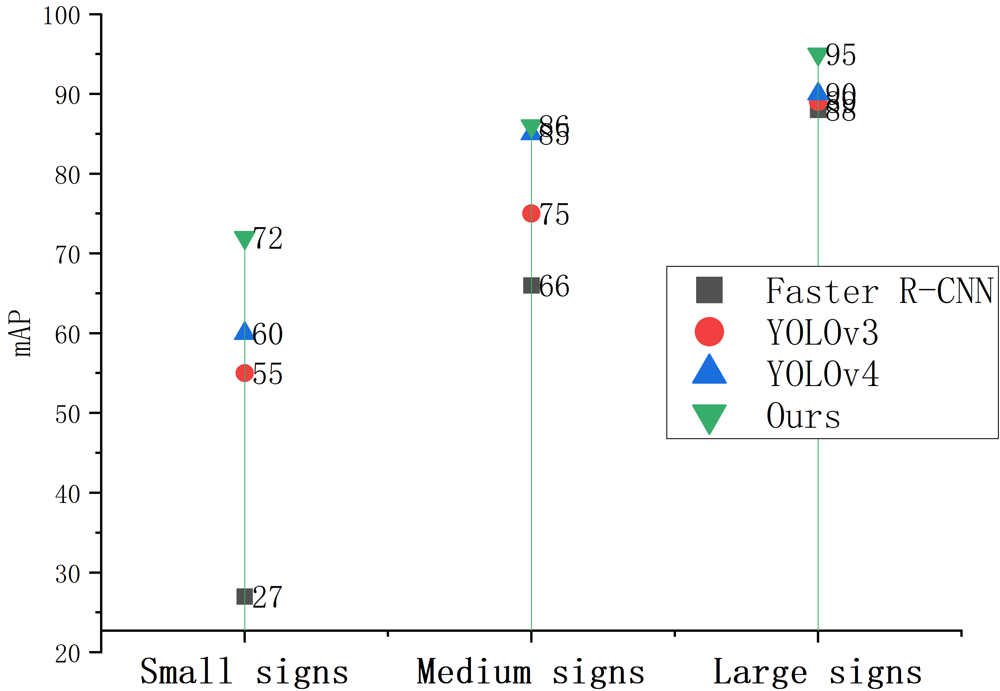
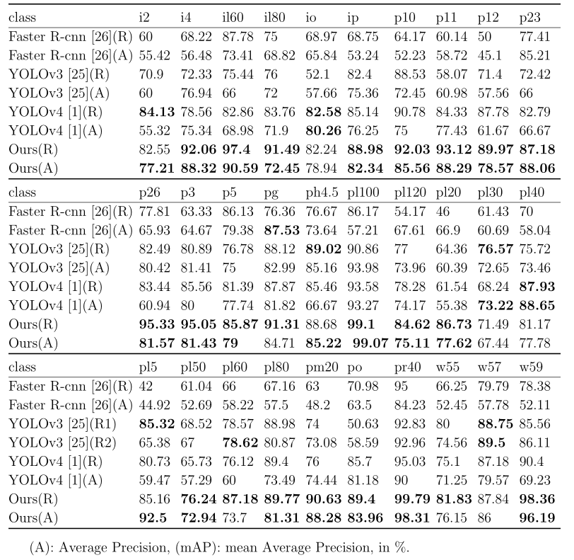

## Attention feature fusion network for small traffic sign detection implementation in pytorch

Abstract: Object detection has made great progress with the rise of convolutional neural networks in recent years. Traffic sign detection is a research hotspot for object detection tasks. The existing detection models have problems such as inaccurate positioning and low classification accuracy when detecting small traffic signs in real-word scene. To address these issues, in this paper, we propose a small traffic sign detection method based on YOLOv4. We design an attention-based feature fusion module including attention spatial pyramid pooling (ASPP) and attention path aggregation networks (APAN). On the one hand, ASPP highlights useful small object information and suppresses invalid interference information in the background.  On the other hand, APAN reduces information loss during feature fusion. 

### Results
##### 1. small traffic sign detection 

mAP is estimated from the TT100K dataset over 6150 selected training and validation images for evaluation.
Small signs (area <32 × 32), Medium signs (32 × 32< area < 96× 96) and Large signs (area >96 × 96)

##### 2. traffic sign detection 

Quantitative results show AP and mAP scores for different classes in the TT100K dataset.

##### 32.Visualization of the experimental results

   

### training steps

1. Data set preparation  
This article uses the VOC format for training, and you need to make your own data set before training  

2. Processing of datasets
After completing the placement of the dataset, we need to use voc_annotation.py to obtain 2007_train.txt and 2007_val.txt for training.     

3. start network training  
**There are many parameters for training, which are all in train.py. You can read the comments carefully after downloading the library. The most important part is still the classes_path in train.py. **
**classes_path is used to point to the txt corresponding to the detection category, which is the same as the txt in voc_annotation.py! Training your own dataset must be modified! **
  

4. Training result prediction  
Training result prediction requires two files, yolo.py and predict.py. Modify model_path and classes_path in yolo.py.
**model_path points to the trained weights file in the logs folder.
classes_path points to the txt corresponding to the detection category. **
After completing the modification, you can run predict.py for detection. After running, enter the image path to detect.  

### Installation Guide
To install the software, follow the instructions provided [HERE](INSTALL.md).

------------------
### License
This work is protected by a [license](LICENSE.md) agreement.